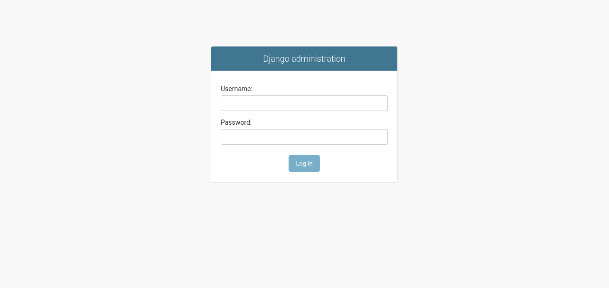
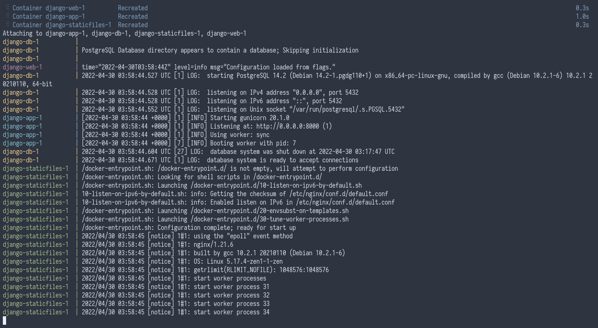

# Example Django Docker

This is a hello world app that is written in [Python](https://www.python.org/), using [Django](https://www.djangoproject.com/) framework, packaged using [Docker](https://www.docker.com/).

## Packaging

This is packaged by using the [Python container image](https://hub.docker.com/_/python) as a base, copying the source code and installs necessary dependencies of this app and adds a startup script.

## Running

There are 2 modes for running this project, "development" and "production", It's up to the developers to define how their apps would behave under development environment and production environment. For example, development mode may use SQLite as a database whereas in production, the app will use PostgreSQL.

In production, [Gunicorn](https://gunicorn.org/) is used as the server, [Nginx](https://www.nginx.com/) is used for serving static files and bytecodes will be generated from the source code for faster startup whereas in development, a development server from Flask is used.

### Development

```
docker compose up --build
```

### Production

```
docker compose --file docker-compose.prod.yml build
docker compose --file docker-compose.prod.yml up db -d
docker compose --file docker-compose.prod.yml run app python manage.py migrate
docker compose --file docker-compose.prod.yml run app python manage.py collectstatic
docker compose --file docker-compose.prod.yml up
```

## Customizing

Docker images can be customized using environment variables or customized during build time using build arguments.

### Environment Variables

| Key | Description |
| --- | --- |
| `POSTGRES_HOST` | Hostname of the database server. |
| `POSTGRES_USERNAME` | Username that will be used to log in into the database server. |
| `POSTGRES_PASSWORD` | Password that will be used to log in into the database server. |
| `POSTGRES_PORT` | Port number that is used to connect to database server. |
| `POSTGRES_DBNAME` | Database that will be used for storing data. |

### Build Arguments

| Key | Description |
| --- | --- |
| `PYTHON_VERSION` | The version of Python that will be used for building this image, note that Python 2 is not supported. |

## Screenshots



